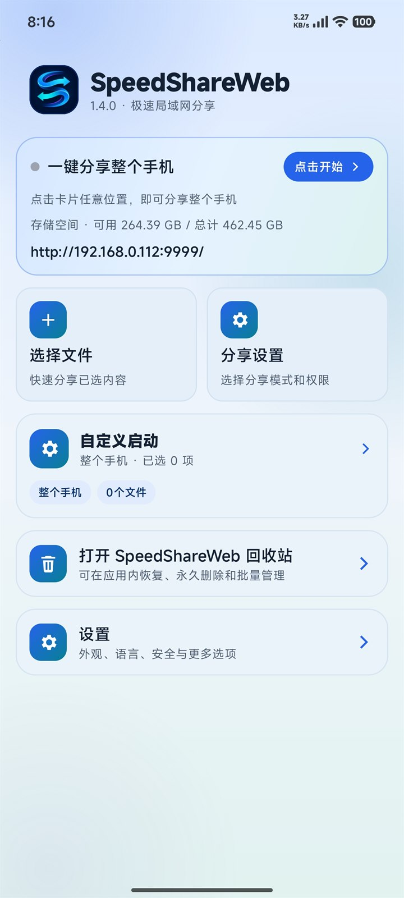
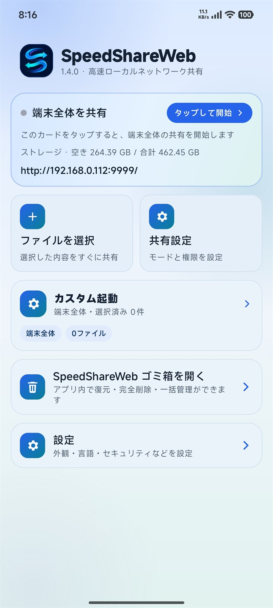
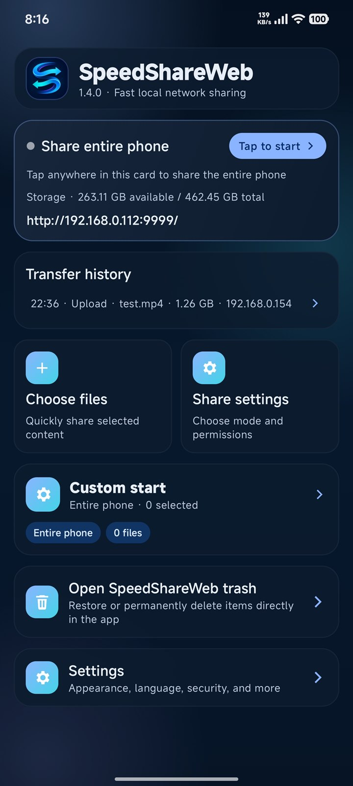
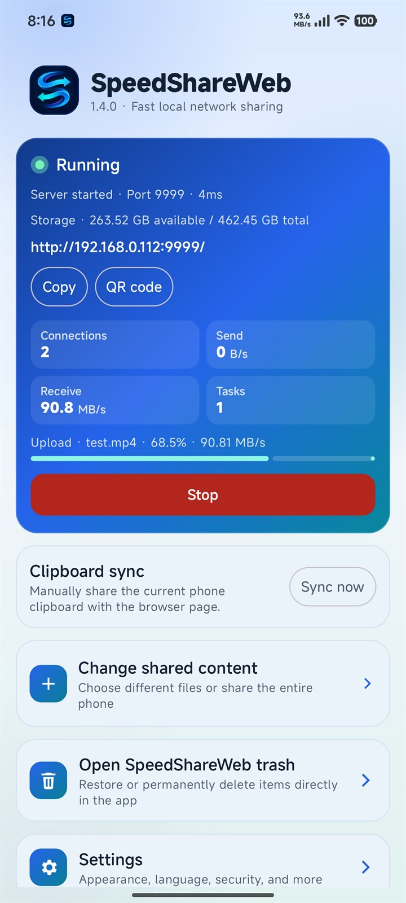
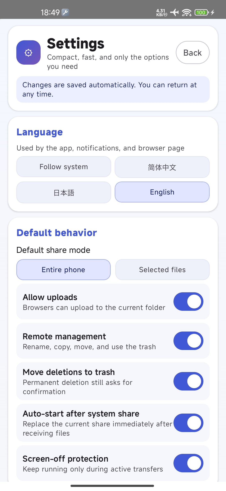
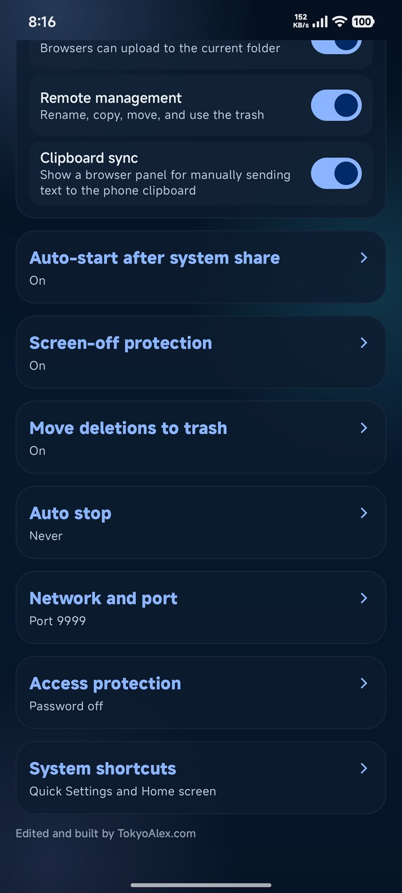
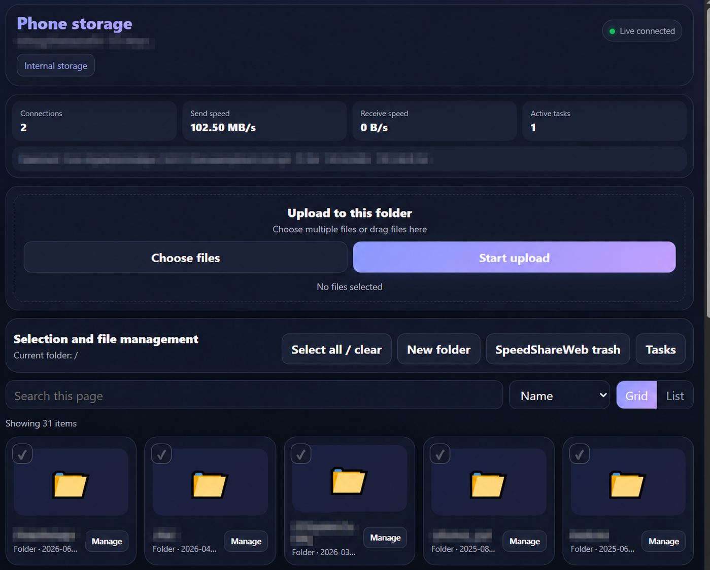

# SpeedShareWeb

Androidスマートフォンを高速なローカルネットワーク用ファイルサーバーにし、ブラウザから直接アクセスできます。

[English](README.md) · [简体中文](README.zh-CN.md)

 

  

v1.4.2 では、認証、HTTP リクエスト検証、トランザクション型アップロード、ファイル操作、ごみ箱からの復元を強化し、長時間利用時の安全性と安定性を向上しました。
その他のバージョンや更新内容については、[GitHub Releases](https://github.com/Dream-City6/SpeedShareWeb/releases)をご確認ください。

## このプロジェクトを作った理由

自宅には複数のスマートフォン、タブレット、パソコンがありますが、それぞれ異なるOSやデバイス環境を使用しています。

ファイルを転送するたびに対応するアプリやサービスを探す必要があり、ルーターの性能を十分に引き出せないうえ、動作が遅く、手間もかかり、広告が表示されるものもありました。

さすがに我慢できなくなり、SpeedShareWebを自分で作りました。同じローカルネットワークに接続されていれば、特定のメーカー、アカウント、クラウドストレージに依存せず、ファイルの閲覧、アップロード、ダウンロード、管理を直接行えます。

## プロジェクト概要

SpeedShareWebを使うと、Android端末と同じローカルネットワーク上にあるスマートフォン、タブレット、パソコンとの間でファイルを転送できます。

受信側の端末にアプリをインストールする必要はありません。SpeedShareWebに表示されるローカルアドレスをブラウザで開くだけで利用できます。

## 主な機能

- スマートフォン、タブレット、パソコンのブラウザからアクセス可能
- アカウントやクラウドストレージは不要
- カード全体をタップして端末全体をすぐに共有
- 接続数、転送速度、実行中のタスク、ファイル進捗をリアルタイム表示
- ファイルの閲覧、アップロード、ダウンロード、移動、削除
- パソコンの右クリックまたはスマートフォンの長押しメニューから主要なファイル操作を実行
- パソコンでの Ctrl/Command/Shift 複数選択と、アップロード前のキューからの個別削除に対応
- フォルダー構造を保持したフォルダーアップロード
- 単一ファイル、複数ファイル、ZIP形式でのダウンロード
- 最近のアップロード、ダウンロード、ファイル操作履歴の確認
- Androidアプリとブラウザページ間の任意のクリップボード同期
- レスポンシブなリスト/グリッド表示と、ファイル・フォルダーのドラッグ＆ドロップアップロード
- ごみ箱からの復元、完全削除、一括削除
- システム連動、ライト、ダークの外観モード
- Androidアプリとブラウザの日本語、簡体字中国語、英語表示
- 広告なし

## スクリーンショット

### Androidアプリ

<table>
  <tr>
    <td align="center">
      
       
      ライトホーム · 簡体字中国語
    </td>
    <td align="center">
      
       
      ライトホーム · 日本語
    </td>
    <td align="center">
      
       
      ダークホームと転送履歴
    </td>
  </tr>
  <tr>
    <td align="center">
      
       
      転送速度、進捗、操作
    </td>
    <td align="center">
      
       
      外観、言語、既定動作
    </td>
    <td align="center">
      
       
      コンパクトなセキュリティとネットワーク設定
    </td>
  </tr>
</table>

### ブラウザファイルマネージャー

  
   
  ドラッグ＆ドロップアップロード、リアルタイム状態、ファイル管理、検索、クリップボード同期

## 使い方

1. Android端末ともう一方の端末を、同じ信頼できるローカルネットワークに接続します。
2. SpeedShareWebでサーバーを起動します。
3. もう一方の端末のブラウザで、表示されたローカルアドレスを開きます。
4. ファイルの閲覧、転送、管理を行います。
5. テキストを同期したい場合は、設定でクリップボード同期を有効にします。
6. 使用後はサーバーを停止します。

## プライバシーとセキュリティ

SpeedShareWebは主にローカルネットワーク内で動作し、アカウントやクラウドストレージを必要としません。

信頼できるネットワーク上でのみ使用し、ローカルHTTPサーバーをインターネットへ直接公開しないでください。

クリップボード同期も同じローカルHTTP接続を使用します。パスワード、認証コード、トークン、その他の機密テキストは同期しないでください。

詳細については、[PRIVACY.md](PRIVACY.md)および[SECURITY.md](SECURITY.md)をご確認ください。

## ライセンス

本プロジェクトは GNU General Public License v3.0 のもとで公開されています。詳細については[LICENSE](LICENSE)をご確認ください。

## 免責事項

SpeedShareWebは、アクセスおよび管理する権限のあるファイルと端末に対してのみ使用してください。本プロジェクトはいかなる保証もなく提供されます。

## 更新履歴

- v1.4.2：認証と HTTP 検証を強化し、アップロードとファイル置換をトランザクション化し、ごみ箱の復元とリソース制限を改善して、自動品質チェックを追加しました。
- v1.4.1：ホーム画面と設定操作、中国語・日本語・英語のレイアウト、繰り返し画面切り替えを改善し、ライト/ダーク表示の可読性を修正して、プロジェクト画像とWebサイト表示を更新しました。
- v1.4.0：新しいブランドアイコンと起動画面、レスポンシブなオーロラUI、端末全体のワンタップ共有、リアルタイム転送操作、ライト/ダーク表示、コンパクト設定、開ける転送履歴、新しいブラウザファイルマネージャーを追加しました。
- v1.3.4：コンパクトなストレージ表示、アップロード予定サイズ、256 MB のシステム予約を含む二重の容量確認、パスワードのみのブラウザログイン画面を追加しました。
- v1.3.3：任意パスワードと接続保護を追加し、並列アップロードの更新中断を修正し、ストレージ間のごみ箱・復元失敗時に完全なコピーを保護するようにしました。
- v1.3.2：右クリックとモバイル用ボトムシート、統一 SVG アイコン、安全な削除導線、アップロード項目の個別削除、デスクトップ範囲選択、アクセシビリティ、大規模フォルダー表示の最適化を追加しました。
- v1.3.0：ブラウザ版ファイル管理を改善し、ローカルネットワーク向けの直接アップロード、制限付きの並列アップロード/ダウンロード、キュー進捗、キャンセル/再試行、検索フィードバック、ブラウザ側設定、ブラウザで再生できない動画向けの分かりやすい案内を追加しました。
- v1.2.0：転送履歴、フォルダー構造を保持したアップロード、ドラッグ＆ドロップ対応、ブラウザ画面の再設計を追加しました。
- v1.1.0：クリップボード同期、ごみ箱管理、ブランド統一、コンパクト画面の改善、Android 側操作の安定化を行いました。
- v0.1.0：Android ローカルファイルサーバー、ブラウザでのファイル閲覧、アップロード、ダウンロード、多言語対応を実装した初期版です。
