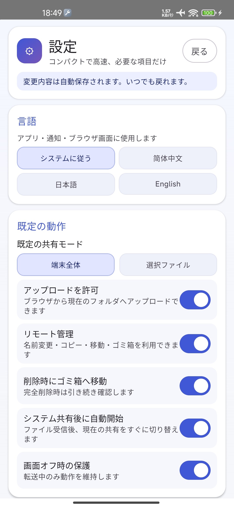

# SpeedShareWeb

把安卓手机临时变成一个本地文件服务器，让电脑、平板和其他手机直接通过浏览器访问。

## 项目简介

SpeedShareWeb 用于在同一局域网内浏览和传输文件。

接收设备不需要安装客户端，只需打开应用显示的本地地址，即可通过浏览器上传、下载、浏览或管理文件。

## 为什么做这个项目

我家里有多台手机、平板和电脑，但这些设备分别属于不同的系统和生态。每次在设备之间传输文件，都需要寻找兼容的应用或借助中转服务，不仅操作麻烦，传输速度也常常无法充分利用家里的局域网带宽。

因此，我开发了 SpeedShareWeb。

它不依赖特定品牌或设备生态。只要设备连接到同一个局域网，并且能够打开浏览器，就可以直接浏览、上传、下载和管理文件。

我也对传输性能进行了优化，希望能够尽可能发挥本地网络和路由器的速度。

我做这个项目，是为了先解决自己的实际需求。如果它也能帮你节省一些传输文件的时间，那就更好了。

## Screenshots

### Android app

<table>
  <tr>
    <td align="center">
      
       
      English interface
    </td>
    <td align="center">
      
       
      Japanese interface and live transfer
    </td>
  </tr>
</table>

### Browser file manager

  

  Browse, upload, download, organize, and restore files directly from a browser on the same local network.

### Settings

<table>
  <tr>
    <td align="center">
      
       
      General settings
    </td>
    <td align="center">
      
       
      Network and shortcuts
    </td>
    <td align="center">
      
       
      Japanese settings
    </td>
  </tr>
</table>

## 主要特点

- 电脑、平板和手机均可通过浏览器访问
- 不需要账号，也不依赖云端存储
- 支持局域网文件浏览、上传和下载
- 提供适配手机与桌面的网页界面
- 支持列表与网格显示
- 支持可选的访问保护
- 适合临时、直接的文件传输
- 无广告

## 使用方法

1. 将安卓手机和另一台设备连接到同一个可信局域网。
2. 在 SpeedShareWeb 中启动本地服务器。
3. 在另一台设备的浏览器中打开应用显示的本地地址。
4. 浏览、上传、下载或管理文件。
5. 使用结束后关闭服务器。

## 隐私与安全

SpeedShareWeb 的设计目标是在局域网内运行，不需要账号或云端存储。

当应用使用普通 HTTP 传输时，不可信网络中的其他设备可能有机会观察网络流量。请只在可信网络中使用，启用可用的访问保护，并在传输结束后关闭服务器。

详细内容请查看 [PRIVACY.md](PRIVACY.md) 和 [SECURITY.md](SECURITY.md)。

## 下载

首个完成测试的签名 APK 将通过 GitHub Releases 发布。

请勿安装非官方第三方重新打包的 APK。

## 开源许可

本项目采用 GNU General Public License v3.0 开源许可证。
详细条款请参阅 LICENSE 文件。
